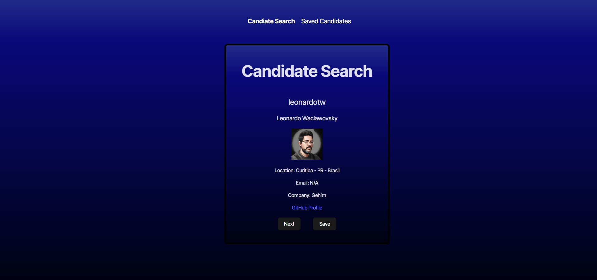

# Candidate Search

## Description

The Candidate Search application is a TypeScript-based React project designed to help employers search for potential candidates using the GitHub API. This application fetches and displays candidate information, allowing users to review profiles and save or reject candidates based on their details. The project leverages TypeScript for improved maintainability, local storage for data persistence, and API integration to fetch real-time user data.

The primary goal of this project is to streamline the candidate selection process by providing a simple and efficient way to browse GitHub profiles. When a candidate is displayed, the user can either save them as a potential candidate or skip to the next profile. A separate view allows users to review saved candidates.

This project demonstrates practical implementation of TypeScript with React, API consumption, and data persistence using local storage. The application is deployed on Render for accessibility.

## Table of Contents

- [Usage](#usage)
- [Mock Up](#mock-up)
- [Instructions](#instructions)
- [Key Features](#key-features)
- [Technology Stack](#technology-stack)
- [Additional Resources](#additional-resources)

## Usage

To run the application locally, follow these steps:

1. Install dependencies:
  ```bash
  npm install
  ```

2. Create a .env file inside the environment folder and add your GitHub API token:
  ```bash
  VITE_GITHUB_TOKEN=your_personal_access_token
  ```

3. Start the development server

4. Open the application in your browser at http://localhost:5173 (or the specified port).


## Mock Up

The following images show the web application's appearance and functionality:




## Instructions

1. Set up environment variables

* Create a GitHub Personal Access Token and add it to .env as VITE_GITHUB_TOKEN.

2. Run the application

* Install dependencies using npm install.

* Start the development server with npm run dev.

3. Using the application

* When the app loads, it will display a GitHub user profile.

* Click the 'Next' button to skip the candidate and move to the next.

* Click the 'Save' button to save the candidate and move to the next.

* Navigate to the "Saved Candidates" page to review accepted candidates.

4. Data Persistence

* Accepted candidates are stored in local storage and persist across page reloads.

## Key Features

* **GitHub API Integration:** Fetches and displays candidate data dynamically.

* **TypeScript for Type Safety:** Ensures maintainable and bug-free development.

* **Candidate Review System:** Allows users to save or reject candidates.

* **Local Storage:** Saves accepted candidates for future reference.

* **Responsive Design:** Works across different screen sizes.

* **Deployment on Render:** Fully deployed and accessible online.

## Technology Stack

* **React with TypeScript:** Provides structure and type safety for the application.

* **Vite:** Used for fast and optimized development.

* **GitHub API:** Fetches real-time candidate profiles.

* **Local Storage:** Persists saved candidates even after refreshing the page.

* **Render:** Deployment platform for hosting the application.

## Additional Resources

* The URL of the deployed application: [Render Deployment](https://candidate-search-v96h.onrender.com/)

* The URL of the GitHub repository: [GitHub Repository](https://github.com/gilmerperez/candidate-search)

* Learn more about the GitHub API: [GitHub REST API Documentation](https://docs.github.com/en/rest/users/users)

* Guide on using environment variables in Vite: [Vite Environment Variables](https://vite.dev/guide/env-and-mode)

* Deployment guide for Render: [Render Deployment Guide](https://coding-boot-camp.github.io/full-stack/render/render-deployment-guide)
